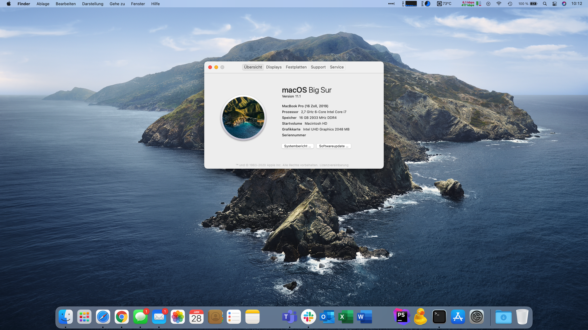

# Dell Latitude 5411 or 5511 with macOS Monterey
A collection of all files needed to run Monterey on a Dell 5411 or 5511.
It will also work with Catalina or Big Sur (checkout older releases)



## 🔍 Overview
This is more of a compilation of information and configs from various repositories and forums than a place where real development happens. This repository should contain everything needed to get Monterey up and running on your Dell Latitude 5411 or 5511 laptop.

## ✔️ Status
| Hardware | Model | Status | Comments |
| ------------- | ------------- | ------------- | ------------- |
| **CPU** | Intel Core i7-10850H | ✅ Working | Power Management fully working. Goes down to 800MHz and boosts to 5.1GHz. 2-3W power consumption in idle stage. |
| **iGPU** | Intel UHD Graphics 630 | ✅ Working | Fully supported including Turbo, QE/CI acceleration, Metal and 2GiB of VRAM but no DRM in Safari |
| **Internal Display** | 1920x1080@60Hz | ✅ Working | Internal eDP display fully working including Backlight control. |
| **External Display(s)** | DP 1.4, HDMI 2.0 via LSPCON | ✅ Working | 3840x1600@85Hz via Thunderbolt/DP and 3840x2160@60Hz via HDMI tested. 4 displays (Internal + 3 external, 2 via Thunderbolt and 1 HDMI) simultaneously working fine. If using a Thunderbolt dock for multiple displays, you can only connect one display to the dock connectors. For the second display, you have to use an additional USB-C display adapter connected to the "Passthrough"/Daisy Chain Thunderbolt port of your dock because macOS does not support MST.  |
| **SSD** | Micron 2300 NVMe 512GB | ✅ Working |
| **Trackpad** | I2C ALPS ???? (Named Dell09C0) | 🔶 Partially | Working with full gesture support (5 fingers) but the hardware buttons are not working. You can use left/right click with touch tap (change in settings). |
| **Wi-Fi/ BT** | Dell DW1560 | ✅ Working | The stock Intel AX Wi-Fi 6 card needs to be swapped out to a compatible card. |
| **LAN** | Intel I219-LM | ✅ Working | |
| **Thunderbolt/ USB-C** | Intel JHL7540 / Titan Ridge 2C 2018 | ✅ Working | USB-C charging works. Thunderbolt and USB-C devices are working. Tested with a Dell WD19TB Thunderbolt Dock and an USB-C iPad. Hotplugging of USB-C displays or USB-C docks with a display attached to it, is buggy sometimes. But USB-C to HDMI or (m)DP adapters are working fine. |
| **USB** | | ✅ Working | All Ports fully working with USB 2.0, 3.0 and 3.1/3.2 speed |
| **Internal Speakers** | Realtek ALC3204 | ✅ Working | Fully working including Mac boot chime |
| **Internal Microphone array** | | ✅ Working |
| **Headphone Jack** | | ✅ Working | Works, including automatic switch to headphone if plugged in. |
| **Webcam** || ✅ Working |
| **SDXC reader** | Realtek RTS525A | ✅ Working |
| **Fingerprint reader** || ❌ Not working | Will never work, because of MacBooks with TouchID and T2 chip and proprietary Windows drivers for Dell. |

| Features | Status | Comments |
| ------------- | ------------- | ------------- |
| **Sleep** | ✅ Working |
| **Lid Open/Close** | ✅ Working | Goes to Sleep when no external display connected and wakes up.
| **Sidecar** | ✅ Working |
| **iMessage and App Store** | ✅ Working | Just use or valid SMBIOS, S/N, MLB and MAC-Address. |
| **Handoff** | ✅ Working | Tested with iPhone 11 Pro Max and iPad Pro 12,9" |
| **Sidecar** | ✅ Working | Tested with iPad Pro 12,9" |
| **Watch Unlock** | ✅ Working | ...most of the time. Tested with Apple Watch series 3 |
| **FileVault 2** | 🔶 Partially | Encryption itself is working fine but generates a huge boot delay (30-60 seconds) until asking for the FileVault password. I think this is an OpenCore bug. This occurred already on the macOS Catalina Beta and was fixed later. |

## 🗒️ To-Do
| Features | Comments | Done |
| ------------- | ------------- | ------------- |
| **Trackpad GPIO fix** | The trackpad is currently configured to work in polling mode because the GPIO Interrupt mode generates very high CPU load | ❌ No |
| **Ghost display on HDMI** | HDMI display stays online after disconnection. Gone after updating the display configuration (e.g. connecting new display or change resolution) | ❌ No |
| **HDMI black screen after wakeup** | No output on the HDMI port after sleep. Works fine again after replugging any display cable. | ❌ No |
| ~~**Multiple displays via Thunderbolt Dock**~~ | ~~Not done yet because of missing Thunderbolt Dock~~ Tested with a Dell WD19TB Thunderbolt Dock. I made some adjustments to the WEG framebuffer patches to enable two displays via Thunderbolt. | ✅ Yes |
| **Battery reading** | Buggy or not updating from time to time when external displays connected | ❌ No |
| ~~**Thunderbolt fix**~~ | ~~Flashing Apple's Original Thunderbolt Firmware to the Titan Ridge 2C 2018 SPI EEPROM~~ (Not needed, as everything works fine) |  |
| ~~**Disable CFG Lock**~~ | ~~Flashing a modded UEFI/BIOS because this option is not listed in the Dell Utility and changes via GRUB setup-var are not working because the EFI writable flag is not set~~ (see section [Adjust UEFI variables](#adjust-uefi-variables-to-enable-4k60hz-and-disable-cfg-lock)) | ✅ Yes |


## 🖥 Installation

### BIOS/UEFI settings
- Secure Boot: Off (Default: On)
- SATA Mode: AHCI (Default: RAID) (Also includes NVMe drives! macOS will not see any drives when using RAID mode)
- Intel SGX: Software Controlled or Off
- Thunderbolt Configuration: No Security

### Adjust UEFI variables to enable 4K@60Hz and disable CFG lock
Needed tools:
**grub-mod-setup_var** on a FAT32 USB-Stick or on the OpenCore EFI  
**Dell_PFS_Extract**, **UEFITool_NE_A58**, **Ifrextractor**
(They are all available for both macOS and Windows).

You can adjust **all UEFI settings** even if the BIOS is password protected as long as booting from external media is allowed and/or SecureBoot is disabled to load the .efi.

My Dell BIOS is version 1.2.15.
**Always dump the correct files for your own BIOS version!**

1. Download your BIOS flash program via Dell (search for your model, then click `Drivers and Downloads` and filter for `BIOS`)
2. Dell_PFS_Extract: Select folder containing your Dell .exe file (This will extract the raw BIOS .bin file)
3. UEFITool_NE_A58: Open `1 System BIOS with BIOS Guard vx.x.x.bin` and export the `Setup` IFR section
4. Ifrextractor: Use `Section_PE32_image_Setup.sct` as input file and write output to `Section_PE32_image_Setup IFR.txt`
5. Find variables by their name in the .txt file via Ctrl + F (e.g. DVMT or CFG or Thunderbolt)

The line should be something like this:
`One Of: DVMT Pre-Allocated, VarStoreInfo (VarOffset/VarName): 0xF5, VarStore: 0x16`
For some BIOS versions (including mine) the variable is not in `VarStore: 0x1` (Setup).
If so, find your correct VarStore at the beginning of the .txt file.

For me it's `VarStore: VarStoreId: 0x16 [72C5E28C-7783-43A1-8767-FAD73FCCAFA4], Size: 0x318, Name: SaSetup` (`SaSetup` instead of `Setup`).

We do the same for the CFG lock:
`One Of: CFG Lock, VarStoreInfo (VarOffset/VarName): 0x3E, VarStore: 0x11`  
`VarStore 0x11` is `CpuSetup`.

**With the new information we are able to build our commands to adjust these variables:**  
`setup_var_cv SaSetup 0xF5 0x2` (0x2 = 64M, default = 32M)  
`setup_var_cv CpuSetup 0x3E 0x0` (0x0 = off, default = on)  
Boot your computer and start a UEFI shell via OpenCore. Then start `grub-mod-setup_var` and run your commands.

Reboot your computer and check.

### Create a bootable installer
Grab a free USB stick with at least 16GiB and format it with HFS+ file system and GUID table.

Download a legal copy of macOS from the App Store using a real Mac and create a bootable installation stick:
`sudo /Applications/Install\ macOS\ Monterey.app/Contents/Resources/createinstallmedia --volume /Volumes/MyVolume`
Rename MyVolume to your USB stick name or drag the Volume into the Terminal window.

Now use the tool `MountEFI` to mount the EFI volume on the USB stick.

### Configuring EFI
Clone this repository to get the base EFI folder. Copy the folder into the EFI partition you have mounted in the previous step.

## 🛠 Configuration
This section talks about configuring the EFI folder for your exact hardware.
Almost all changes are done inside the OpenCore configuration file. Use the provided version of [ProperTree](https://github.com/corpnewt/ProperTree) to edit `EFI/OC/config.plist`.

### 🌐 Wi-Fi/Bluetooth
The stock Intel Wi-Fi cards are still unstable in macOS.
So to use Wi-Fi with "AirPort feeling", you will have to replace it for a supported card. This repo is configured to work out-of-the-box with many Dell Broadcom adapters (cheap on Ebay).

### 🖥️ Display
You should enable subpixel antialiasing for non-retina screens with this command:
`defaults write -g CGFontRenderingFontSmoothingDisabled -bool NO`
In addition, 5411 (14") users can use SwitchResX to create a custom HiDPI resolution to get greater screen rendering. FHD with 14" is quite small.

### 🌙 Sleep
If you are facing random wakeups while the lid is closed, apply the following settings:
```
sudo pmset -a hibernatemode 0
sudo pmset -a standby 0
sudo pmset -a autopoweroff 0
sudo pmset -a powernap 0
```

### ⚡️ Performance
CPU power management is done by `CPUFriend.kext` while `CPUFriendDataProvider.kext` defines how it should be done. `CPUFriendDataProvider.kext` is generated for a specific CPU and power setting. The one supplied in this repository was made for the Intel Core i7-10850H and is optimized for optimized performance (like on normal MacBook Pro's). In case you have another CPU or would rather sacrifice some performance in trade for more battery life, you can use the script in the `Tools` folder to generate your own ```CPUFriendDataProvider.kext```.

Keep in mind that the fan used in the Latitude 5411 and 5511 is really bad. I used the tool "Macs Fan Control" to muzzle this turbine.

## ⚽ Conclusion
I am using this computer for my everyday work without any issues, crashes etc. For me it is the best Hackintosh experience so far on a laptop.
Feel free to add improvements via PR and report issues 🙂

Happy hacking!

## 🖊️ Credits
- [Apple](http://apple.com) for providing macOS
- [dortania](https://dortania.github.io/OpenCore-Install-Guide/) for providing OpenCore and documentation
- [acidanthera](https://github.com/acidanthera) for providing almost all kexts and drivers
- [vit9696](https://github.com/vit9696) for providing Lilu.kext 
- [alexandred](https://github.com/alexandred) for providing VoodooI2C
- [RehabMan](https://github.com/RehabMan) for providing many laptop [hotpatches](https://github.com/RehabMan/OS-X-Clover-Laptop-Config/tree/master/hotpatch) and guides
- [jaromeyer](https://github.com/jaromeyer/XPS9570-Catalina) for providing the readme template with tutorials and status tables.
